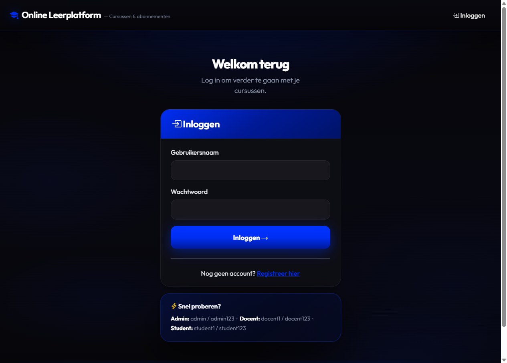
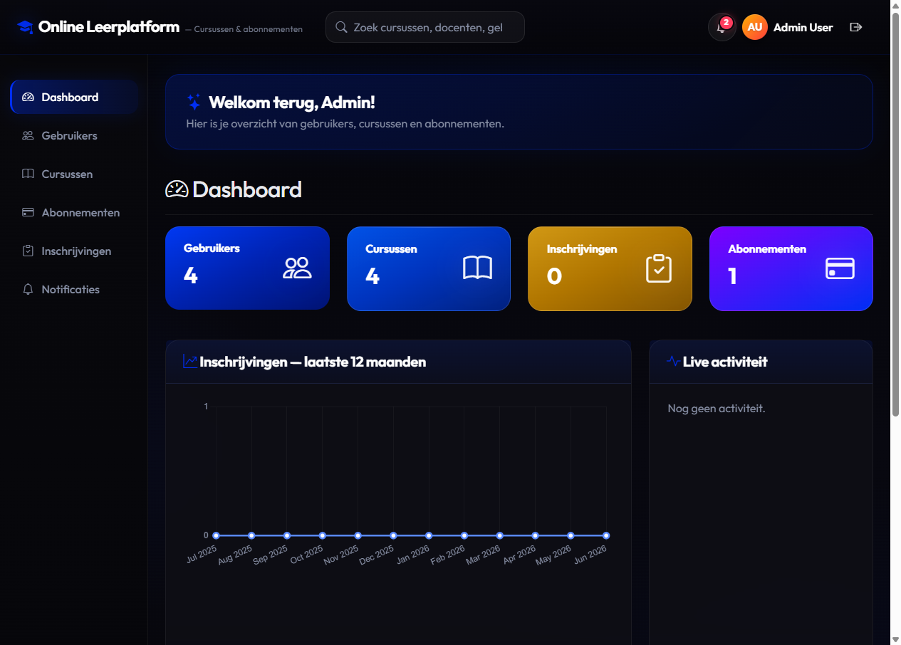
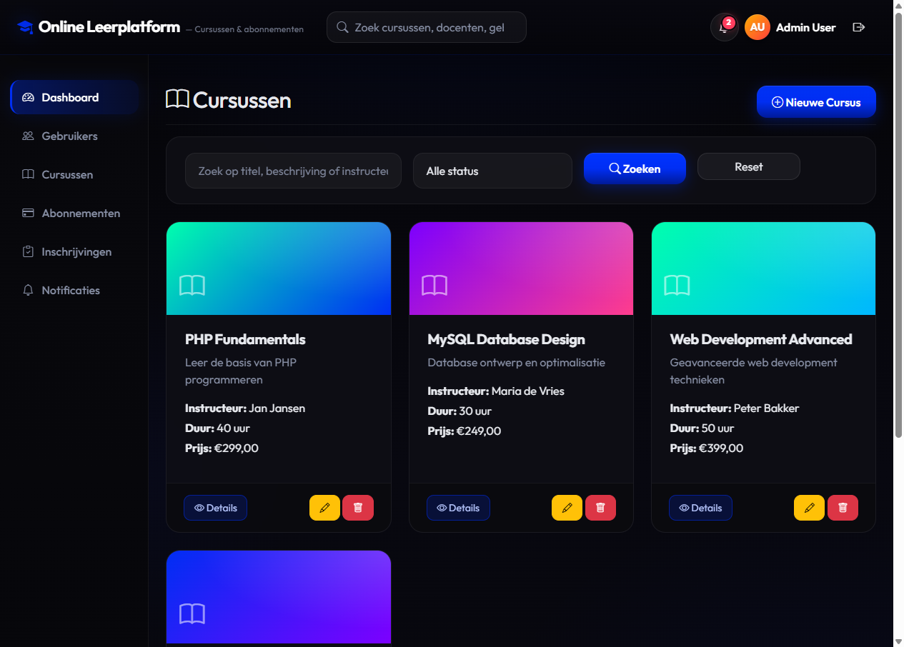
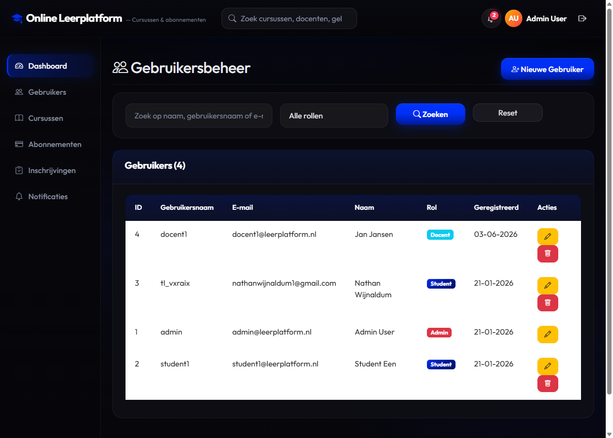
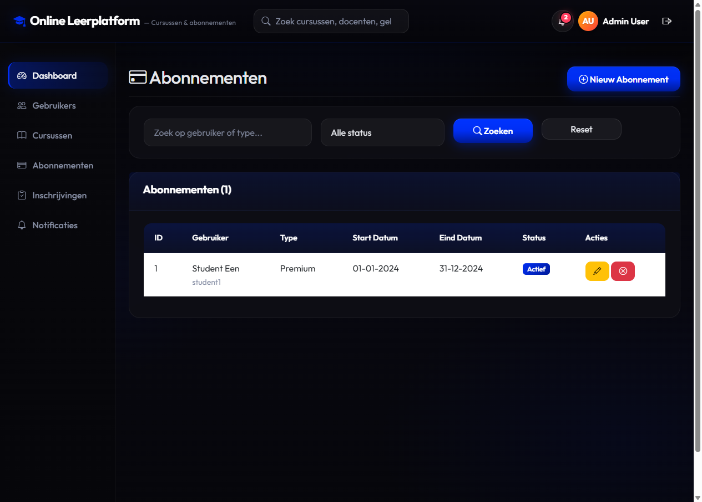

# Online Leerplatform - Cursus & Abonnement Beheer

Een moderne webapplicatie voor het beheren van cursussen, gebruikers en abonnementen. Gebouwd met **PHP 8** en **MySQL/MariaDB**, met **Bootstrap 5** UI, **rolgebaseerde toegang** (admin / docent / student) en **PDO prepared statements**.


## Inhoudsopgave

- [Screenshots](#screenshots)
- [Functies](#functies)
- [Vereisten](#vereisten)
- [Installatie](#installatie)
- [Database Setup](#database-setup)
- [Gebruik](#gebruik)
- [Beveiliging](#beveiliging)
- [Projectstructuur](#projectstructuur)

## Screenshots

### Inlogpagina


### Admin-dashboard met statistieken


### Cursus-overzicht


### Gebruikersbeheer


### Abonnementenbeheer


## Functies

### Gebruikersbeheer (Admin)
- ✅ Gebruiker registreren
- ✅ Overzicht van alle gebruikers
- ✅ Gebruikersgegevens wijzigen
- ✅ Gebruiker verwijderen
- ✅ Zoeken en filteren op naam, gebruikersnaam, e-mail en rol

### Cursusbeheer (Admin)
- ✅ Nieuwe cursus toevoegen
- ✅ Overzicht van cursussen
- ✅ Cursus aanpassen
- ✅ Cursus activeren/deactiveren
- ✅ Cursus verwijderen
- ✅ Zoeken en filteren op titel, beschrijving en instructeur

### Abonnementen (Admin)
- ✅ Abonnement toekennen aan gebruiker
- ✅ Abonnement wijzigen
- ✅ Abonnement beëindigen
- ✅ Overzicht actieve abonnementen
- ✅ Zoeken en filteren op gebruiker en type

### Inschrijvingen
- ✅ Gebruiker inschrijven voor cursus (Admin & Student)
- ✅ Overzicht cursussen per gebruiker
- ✅ Inschrijving verwijderen
- ✅ Filteren op gebruiker en cursus

### Extra Functionaliteiten
- ✅ Login & rolgebaseerde toegang (admin/student)
- ✅ Dashboard met statistieken
- ✅ Zoek- en filterfunctionaliteit
- ✅ Responsive design met Bootstrap 5
- ✅ Wachtwoord hashing met PHP password_hash()
- ✅ Server-side validatie

## Vereisten

- PHP 7.4 of hoger
- MySQL 5.7 of hoger (of MariaDB 10.2+)
- Apache/Nginx webserver
- PDO MySQL extensie voor PHP

## Installatie

### Stap 1: Bestanden kopiëren

Kopieer alle bestanden naar je webserver directory (bijv. `htdocs`, `www`, of `public_html`).

### Stap 2: Database configuratie

Open `config/database.php` en pas de database instellingen aan:

```php
define('DB_HOST', 'localhost');
define('DB_NAME', 'leerplatform');
define('DB_USER', 'root');
define('DB_PASS', '');
```

### Stap 3: Database aanmaken

Maak een nieuwe MySQL database aan met de naam `leerplatform` (of gebruik de naam die je hebt ingesteld in stap 2).

### Stap 4: Database schema importeren

Importeer het SQL-bestand `database.sql` in je database:

**Via phpMyAdmin:**
1. Open phpMyAdmin
2. Selecteer de database `leerplatform`
3. Ga naar het tabblad "Importeren"
4. Kies het bestand `database.sql`
5. Klik op "Uitvoeren"

**Via command line:**
```bash
mysql -u root -p leerplatform < database.sql
```

### Stap 5: Toegang tot de applicatie

Open je browser en ga naar:
```
http://localhost/[jouw-project-map]/
```

## Database Setup

Het database schema bevat de volgende tabellen:

- **users**: Gebruikersgegevens (admin en studenten)
- **courses**: Cursusinformatie
- **subscriptions**: Abonnementen van gebruikers
- **enrollments**: Inschrijvingen van gebruikers voor cursussen

### Standaard accounts

Na het importeren van de database zijn de volgende accounts beschikbaar:

| Rol | Gebruikersnaam | Wachtwoord |
|---|---|---|
| Admin | `admin` | `admin123` |
| Docent | `docent1` | `docent123` |
| Student | `student1` | `student123` |

> Wijzig deze wachtwoorden direct na de eerste login. Nieuwe wachtwoord-hashes
> genereren kan met `php setup_passwords.php`.

## Gebruik

### Als Admin

1. **Inloggen** met het admin account
2. **Dashboard** bekijken met statistieken
3. **Gebruikers beheren:**
   - Nieuwe gebruikers toevoegen via "Gebruikers" → "Nieuwe Gebruiker"
   - Bestaande gebruikers bewerken of verwijderen
4. **Cursussen beheren:**
   - Nieuwe cursussen toevoegen via "Cursussen" → "Nieuwe Cursus"
   - Cursussen activeren/deactiveren of verwijderen
5. **Abonnementen beheren:**
   - Abonnementen toekennen aan gebruikers
   - Abonnementen bewerken of beëindigen
6. **Inschrijvingen beheren:**
   - Gebruikers handmatig inschrijven voor cursussen
   - Inschrijvingen bekijken en verwijderen

### Als Student

1. **Registreren** via "Registreren" of inloggen met bestaand account
2. **Dashboard** bekijken met eigen cursussen
3. **Cursussen bekijken:**
   - Beschikbare cursussen bekijken via "Cursussen"
   - Cursusdetails bekijken
4. **Inschrijven voor cursussen:**
   - Je kunt jezelf inschrijven als je een actief abonnement hebt
   - Inschrijvingen bekijken via "Mijn Cursussen"
   - Jezelf uitschrijven indien gewenst

## Beveiliging

De applicatie implementeert de volgende beveiligingsmaatregelen:

- ✅ **Wachtwoord hashing**: Gebruikt PHP `password_hash()` met bcrypt
- ✅ **Prepared statements**: Alle database queries gebruiken PDO prepared statements tegen SQL injection
- ✅ **Input sanitization**: Alle gebruikersinput wordt gesanitized met `htmlspecialchars()` en `strip_tags()`
- ✅ **Session management**: Gebruikt PHP sessions voor authenticatie
- ✅ **Rolgebaseerde toegang**: Admin en student rollen met verschillende toegangsrechten
- ✅ **Server-side validatie**: Alle formulieren worden gevalideerd op de server
- ✅ **CSRF bescherming**: Formulieren gebruiken POST methoden

## Projectstructuur

```
/
├── config/
│   ├── config.php          # Applicatie configuratie en helper functies
│   └── database.php        # Database connectie
├── includes/
│   ├── header.php          # HTML header met navigatie
│   ├── footer.php           # HTML footer
│   ├── admin_sidebar.php   # Admin navigatie sidebar
│   └── student_sidebar.php # Student navigatie sidebar
├── index.php               # Dashboard
├── login.php               # Inlogpagina
├── register.php            # Registratiepagina
├── logout.php              # Uitlog functionaliteit
├── users.php               # Gebruikersoverzicht (Admin)
├── user_add.php            # Nieuwe gebruiker toevoegen (Admin)
├── user_edit.php           # Gebruiker bewerken (Admin)
├── courses.php             # Cursussenoverzicht
├── course_add.php          # Nieuwe cursus toevoegen (Admin)
├── course_edit.php         # Cursus bewerken (Admin)
├── course_detail.php       # Cursusdetails
├── subscriptions.php       # Abonnementenoverzicht (Admin)
├── subscription_add.php    # Nieuw abonnement toevoegen (Admin)
├── subscription_edit.php   # Abonnement bewerken (Admin)
├── enrollments.php         # Inschrijvingenoverzicht (Admin)
├── enrollment_add.php      # Nieuwe inschrijving toevoegen (Admin)
├── enrollment_delete.php   # Inschrijving verwijderen
├── enroll_student.php      # Student zelf inschrijven
├── my_courses.php          # Mijn cursussen (Student)
├── database.sql            # Database schema en seed data
└── README.md               # Deze documentatie
```

## Technische Details

### Database Relaties

- **users** ↔ **subscriptions**: One-to-Many (een gebruiker kan meerdere abonnementen hebben)
- **users** ↔ **enrollments**: One-to-Many (een gebruiker kan meerdere inschrijvingen hebben)
- **courses** ↔ **enrollments**: One-to-Many (een cursus kan meerdere inschrijvingen hebben)

### Validatie

- E-mailadressen worden gevalideerd met `filter_var()`
- Wachtwoorden moeten minimaal 6 tekens lang zijn
- Alle verplichte velden worden gecontroleerd
- Datumvalidatie voor abonnementen (einddatum na startdatum)

### Styling

De applicatie gebruikt Bootstrap 5 voor responsive design en moderne UI componenten. Bootstrap Icons worden gebruikt voor iconen.

## Troubleshooting

### Database connectie fout
- Controleer of MySQL draait
- Verifieer database credentials in `config/database.php`
- Zorg dat de database bestaat

### Login werkt niet
- Controleer of de database correct is geïmporteerd
- Verifieer dat sessions werken (check `php.ini`)

### Pagina niet gevonden
- Controleer of mod_rewrite is ingeschakeld (voor Apache)
- Verifieer de base URL in `config/config.php`

## Licentie

Dit project valt onder de [Educational Use License](LICENSE). Het is bedoeld
voor school-/studiedoeleinden. Bronvermelding bij hergebruik is verplicht;
plagiaat wordt niet toegestaan.

## Contact

Voor vragen of problemen, neem contact op met de ontwikkelaar.

